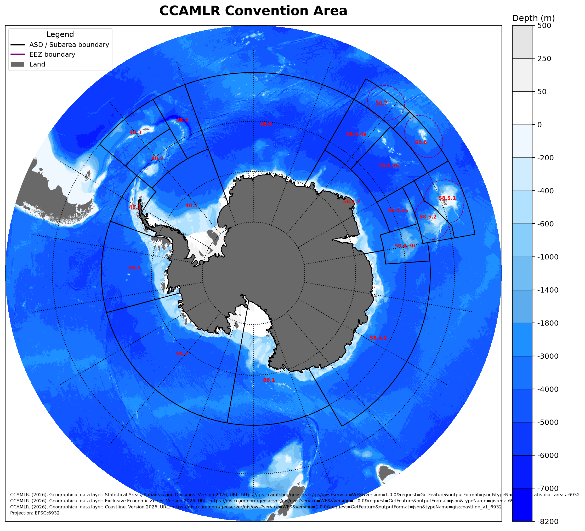
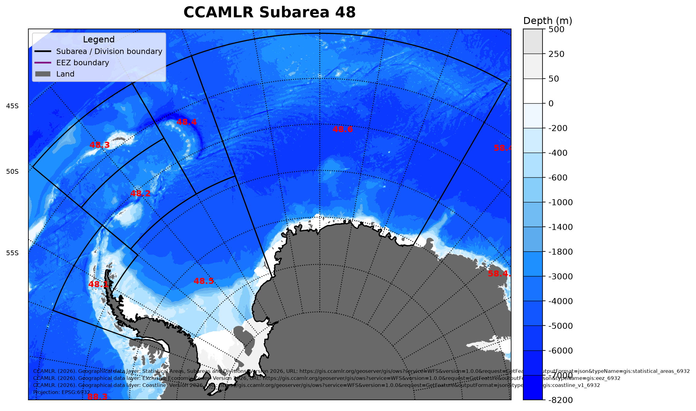
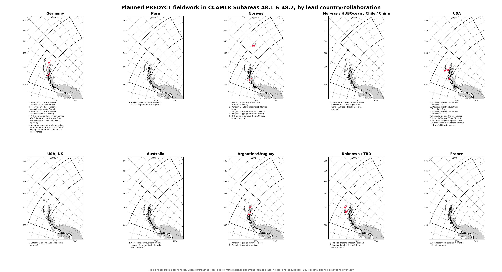
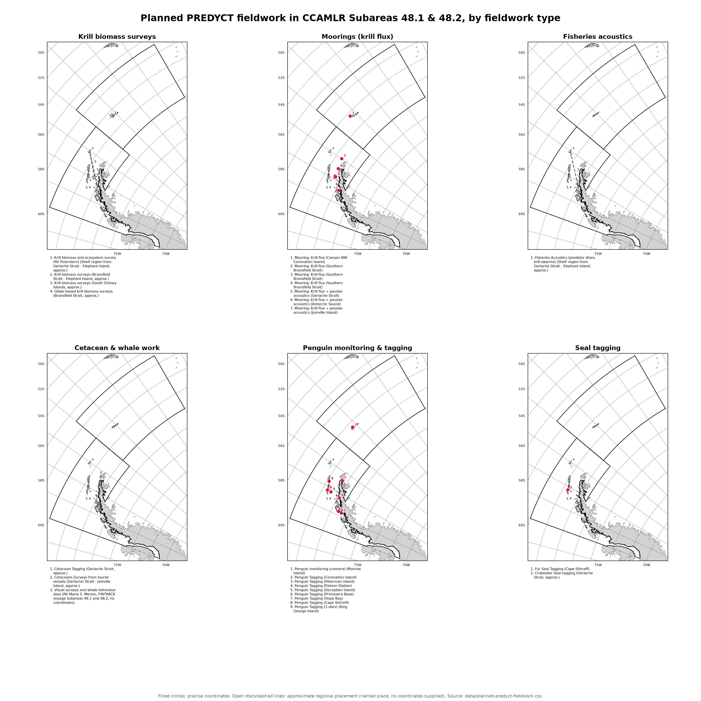
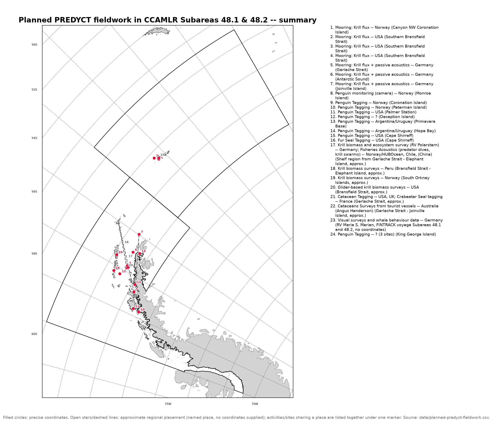

# southern-ocean-maps

Original figures built with [ccamlrgis](https://github.com/Zephyr-Sylvester/ccamlrgis-py),
the Python port of the CCAMLR `CCAMLRGIS` R package. Not affiliated with
CCAMLR; authoritative data remains at https://gis.ccamlr.org/.

## Setup

```
mamba env create -f environment.yml
mamba activate southern-ocean-maps
python make_overview_map.py
```

(`environment.yml` installs `ccamlrgis` in editable mode from `../ccamlrgis-py`
-- both repos need to be sibling directories.)

## Figures

### CCAMLR Convention Area overview

`make_overview_map.py` -> `output/ccamlr_overview.png`

Full-resolution bathymetry (`load_bathy`), ASD/Subarea boundaries and
labels, EEZ boundaries, coastline, a reference grid, a non-overlapping
colour scale, a custom shape legend, and a rule-9 data-source/projection
attribution caption -- all in the CCAMLR standard CRS (EPSG:6932).



### Subarea 48 zoom

`make_subarea48_map.py` -> `output/subarea48_overview.png`

The same style, cropped to CCAMLR Subarea 48 (Antarctic Peninsula /
Scotia Sea) at a higher bathymetry resolution.



### Planned PREDYCT fieldwork, Subareas 48.1 & 48.2

`fieldwork_common.py` holds the shared plotting logic (basemap, numbered
markers, wrapped footnotes, near-duplicate grouping) for three figures,
all reading `data/planned-predyct-fieldwork.csv` -- gitignored, not in
this repo; supply your own CSV with `Location,Longitude,Latitude,Activity,Who`
columns to reproduce any of them.

All three: filled circles are precise GPS coordinates from the CSV; open
stars and dashed lines are approximate placements for named regions the
CSV didn't supply coordinates for (not survey boundaries), using a small
manually-curated table of region coordinates (`PLACE_COORDS`) rather than
anything derived automatically. Numbered markers (with a white text halo
for legibility over the basemap) avoid label collisions where sites
cluster close together; sites at the same named place are also grouped
into a single marker/footnote entry (`LOCATION_ALIASES`, e.g. three
separate King George Island penguin-tagging efforts collapse to one
"(3 sites)" entry) rather than stacking near-identical markers.

**By country** -- `make_subarea48_fieldwork_by_country.py` ->
`output/subarea48_fieldwork_by_country.png`. One panel per leading
country/collaboration, each showing where that group's planned krill,
mooring, cetacean, penguin and seal fieldwork falls.



**By fieldwork type** -- `make_subarea48_fieldwork_by_type.py` ->
`output/subarea48_fieldwork_by_type.png`. One panel per discipline (krill
biomass surveys, moorings, fisheries acoustics, cetacean & whale work,
penguin monitoring & tagging, seal tagging) instead of per country.
Activity strings are mapped to a fieldwork type by keyword match
(`categorize()`); it raises if a new CSV row doesn't match any known
keyword, rather than silently dropping it into the wrong panel.



**Summary** -- `make_subarea48_fieldwork_summary.py` ->
`output/subarea48_fieldwork_summary.png`. A single unfaceted map of every
planned activity, meant to show *where* effort concentrates rather than
compare countries or disciplines -- e.g. that Gerlache Strait has both
cetacean tagging and crabeater seal tagging planned, which the faceted
figures above can't show since each activity sits in its own panel.
Activities sharing a place are listed together under one marker rather
than distinguished by marker colour, since overlapping translucent
colours at the same point blend into a colour matching neither legend
entry.



## License

GPL-3.0-or-later (`LICENSE`), matching `ccamlrgis-py`.
